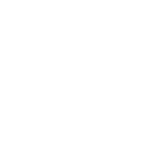

# About openSUSE Linux

## SUSE the Company

    
    

SUSE is a German-based multinational open-source software company that develops and sells Linux products to business customers. Founded in 1992, it was the first company to market Linux for enterprise. It is the developer of SUSE Linux Enterprise and the primary sponsor of the community-supported openSUSE Project, which develops the openSUSE Linux distribution. While the [**openSUSE Tumbleweed**](openSUSE-Tumbleweed.md) variation is an upstream distribution for both the "Leap" variation and SUSE Linux Enterprise distribution, its branded "Leap" variation is part of a direct upgrade path to the enterprise version, which effectively makes [**openSUSE Leap**]((openSUSE-Leap.md)) a non-commercial version of its enterprise product.
    

In July 2018, [Micro Focus International](https://en.wikipedia.org/wiki/Micro_Focus), SUSE's parent company since 2014, announced its plan to sell the business unit to a subsidiary of [EQT Partners](https://eqtgroup.com/current-portfolio/suse) in the first quarter of calendar year 2019. This acquisition was completed on 15 March 2019, making [SUSE](https://eqtgroup.com/current-portfolio/suse) a standalone business. Under new ownership, their legal name is [SUSE Software Solutions Germany GmbH](https://www.suse.com/).

### Acquisition of Rancher Labs

On 8 July 2020, SUSE announced its definitive agreement to acquire [Rancher Labs](https://rancher.com/), which provides a Kubernetes management platform. The acquisition closed on 1 December 2020, at which time Rancher CEO and cofounder Sheng Liang became SUSE's President of Engineering and Innovation.

## SUSE Linux Enterprise vs. openSUSE

    

### [openSUSE Leap](openSUSE-Leap.md)

    

**openSUSE Leap** uses source and newly also binaries from SUSE Linux Enterprise (SLE), which gives Leap a level of stability unmatched by other Linux distributions, and combines that with community developments to give users, developers and sysadmins the best stable Linux experience available.

Contributor and enterprise efforts for Leap bridge a gap between matured packages and newer packages found in other distribution [**openSUSE Tumbleweed**](openSUSE-Tumbleweed.md).
    

    

### [openSUSE Tumbleweed](openSUSE-Tumbleweed.md)

    

**openSUSE Tumbleweed** uses source and newly also binaries from SUSE Linux Enterprise (SLE), which gives Leap a level of stability unmatched by other Linux distributions, and combines that with community developments to give users, developers and sysadmins the best stable Linux experience available.

Contributor and enterprise efforts for Leap bridge a gap between matured packages and newer packages found in other distribution [**openSUSE Tumbleweed**](openSUSE-Tumbleweed.md).
    

#### [openSUSE Factory](openSUSE-Factory.md)

## [openSUSE Kubic](openSUSE-Kubic.md)

## [openSUSE MicroOS](openSUSE-MicroOS.md)

    
    

    

