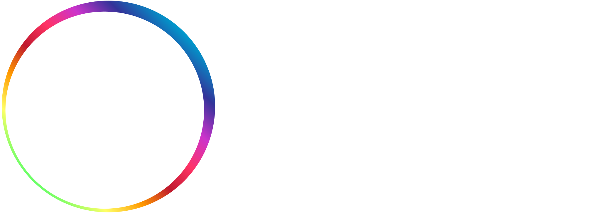
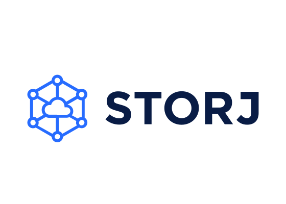

# Our Partners

## Software & Hardware Development Companies

### [AIKIT Digital](https://www.aikitdigital.com/)

    

[AIKIT](https://www.aikitdigital.com/) is a full service software studio that creates products and solutions for cutting-edge consumer facing brands. Few selected developers, a team of skilled engineers to execute your ideas, or a complete software solution. We support whatever you need on-site or remote, so you can focus on your business.

### [SatoshiLabs](https://satoshilabs.com/)

### [Tropic Square](https://tropicsquare.com/)

## Projects building on [Cardano](/about-cardano/)

### [Liqwid Finance](https://liqwid.finance/)

    

[Liqwid](https://liqwid.finance/) is an open source, algorithmic and non-custodial interest rate protocol built for lenders, borrowers and developers. Users can securely earn interest on deposits and borrow assets with ease while earning yield on ADA from four yield streams.

### [projectNEWM](https://projectnewm.io/)

    

[projectNEWM]((https://projectnewm.io/)) is a decentralized ecosystem where you can listen to your favorite music and also earn money if you choose to partake in the NEWM marketplace. Imagine a fair stock market of music, where artists can sell partial music rights and fans can invest and reap the rewards of the music they love; where everyone benefits and receives tokenized royalties from streams directly to their wallet. That’s what we’re doing, and we are pioneers.

### NuPeerStack

### ADOSIA

## Other Blockchains and projects building on other Blockchains

### [Ergo](https://ergoplatform.org/en/)

### [Storj](https://www.storj.io/)

    

[Storj DCS](https://www.storj.io/) is the world’s first open-source, decentralized cloud storage layer that’s private by design and secure by default - enabling developers to build in the best data protection and privacy into their applications as possible. The zero trust architecture, multi-region high availability, default encryption and edge-based access controls minimize risk and give only you, or those you grant permission to, access to your files. The result is that you take back full ownership and control of your data.

