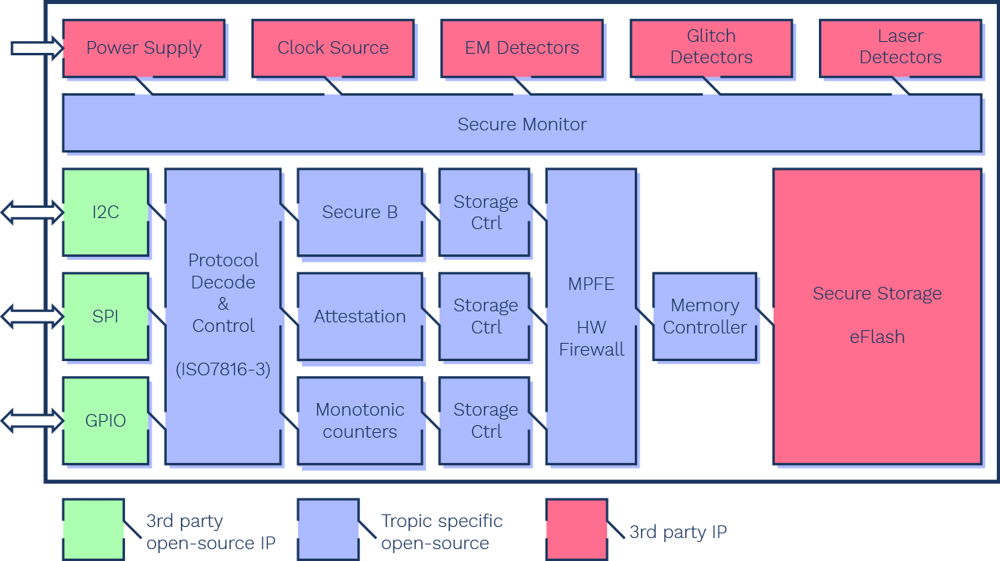

# About TASSIC

Developed by a Czech company [Tropic Square](https://tropicsquare.com/), **TASSIC** is *The Transparent Authenticated Secure Storage Integrated Circuit*, basically an open source version of the secure element that Ledger is using.

## TASSIC

    
    

The Transparent Authenticated Secure Storage Integrated Circuit, TASSIC in short, is the first custom chip (ASIC) we are working on at Tropic Square.

TASSIC is a minimalistic implementation of fundamental functionality - secure storage and associated cryptography to securely store digital data.

Check out [TASSIC flyer](assets/TASSIC_TropicSquare.pdf) to learn more! [Subscribe](https://tropicsquare.us7.list-manage.com/subscribe/post?u=a87eb6070c965ef1be1b02854&id=0b8dfefee1) or [follow us on Twitter](https://twitter.com/tropicsquare) to stay up to date.
    

**TASSIC** will be available in several form factors, including a form factor that will be easy to [plug-in to your Trezor Model T](../about-Trezor/#trezor-model-t). In addition to that, **TASSIC** can be added to [Turris Omnia 2022](../about-Turris/Turris-Omnia-2022.md), which we can call Cardano edition when it will be powered by openSUSE MicroOS with transactional updates which will replace [OpenWRT based Turris OS](https://www.turris.com/en/turris-os/).

Previous versions of Turris Omnia have already been running [openSUSE](../../about-openSUSE/) already, including [Turris MOX](https://www.turris.com/en/mox/overview/) which is more lego-like version of [Turris](../about-Turris/).
